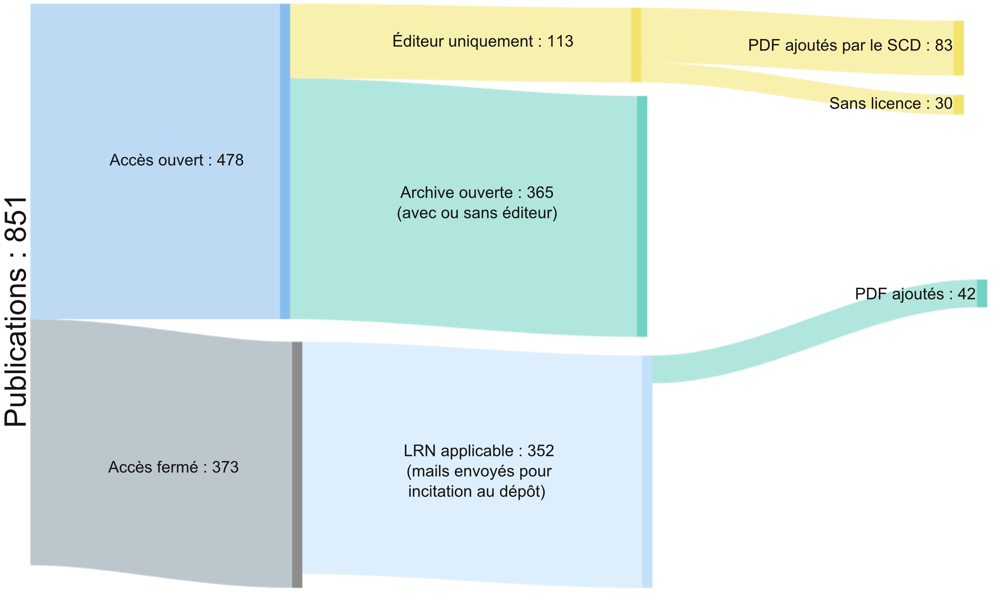

# Imports HAL et incitation à l'accès ouvert


Après avoir publié un article sientifique les auteurs reçoivent des spams les invitant à payer pour publier dans des revues prédatrices. Ce dépôt reproduit la même méthode mais pour une fin plus éthique : inviter les auteurs à partager en **accès ouvert** leur article dans HAL, comme l'autorise la loi [Pour une république numérique](https://www.ouvrirlascience.fr/guide-application-loi-republique-numerique-article-30-ecrits-scientifiques-version-courte/).


Le code partagé permet : 

* d'enrichir les métadonnées des publications de Scopus et de verser automatiquement dans HAL

* de constituer une base de données locale des auteurs affiliés à son établissement

* d'envoyer des mails aux auteurs les incitant à déposer leur article en accès ouvert (voir [modèle de mail](./data/stable/message.txt))

<br />

***

## News

* 2021-09, Publication dans le BBF _Ouvrir l’accès aux dernières publications de son établissement avec HAL. Retour d’expérience sur la mise en place d’un chantier d’import à l'UVSQ_ [hal-03339754](https://hal.archives-ouvertes.fr/hal-03339754)

* 2021-06, Présentation au GT bibliométrie de l'URFIST (voir [slides](https://speakerdeck.com/mlarrieu/science-ouverte-et-suivi-des-publications-exemple-de-realisation-a-luvsq-hal-plus-scopus-plus-unpaywall))

* 2021-04, Alignement IDREF avec l'ABES de la base de données auteurs : ~ 820 auteurs (sur 1150) alignés automatiquement


## Statistiques après 10 mois de chantier




Voir les imports effectués : [contributorId_i/751146](https://hal.archives-ouvertes.fr/search/index/q/*/contributorId_i/751146)

***

<br />

## Reproduire le code pour son établissement

### 0. Configuration
- Installer python et les librairies listées dans le fichier [requirement.txt](./requirement.txt)
- Télécharger et dézipper ce dépôt github
- Créer un fichier décrivant vos laboratoires à l'instar du fichier [data/stable/labCriteria.csv](./data/stable/labCriteria.csv)
- Personnaliser les modèles de mails présents dans `data/stable/`
- Créer un fichier csv pour récupérer les données auteurs affiliés à votre établissement, avec les colonnes `key, surname, forename, initial, labname, orcid, mail, scopusId`
- Créer le fichier `path_and_perso_data.json` dans le dossier  `data/stable/` avec vos informations en respectant le modèle suivant : 

```json
{
	"path_labCriteria":"chemin + nom du fichier décrivant les laboratoires. voir ./data/stable/labCriteria.csv",
	"path_validAuthDb": "chemin + nom de la base de données locale en .csv sur les auteurs de votre établissement",
	"univ_scopusId" : 60029937,
	"univ_halStructId" : 81173,
	"perso_hal_contributorId" : 751146,
	"perso_login_halPreprod" : "login compte preprod hal",
	"perso_mdp_halPreprod" : "mdp compte preprod hal",
	"perso_login_hal" : "login compte hal",
	"perso_mdp_hal" : "mdp compte HAL",
	"perso_email": "your.email@univ.fr",
	"alias_email" : "un alias pour assurer le suivi des mails envoyés en équipe hal.bib@uvsq.fr",
	"perso_scopusApikey" : false,
	"perso_scopusInstToken": false,
	"perso_login_server": "login pour se connecter au serveur",
	"perso_pwd_server" : "mot de passe"
}

```

<br />

### 1. Préparer les données

- Ouvrir le code `1_produce_tei_and_deposit2hal.py`, à partir de l'exemple en commentaire déduire une requête scopus

- Extraire les publications (format `csv` avec toutes les informations) et placer le fichier dans `data/scopus_biblio/`

- Indiquer le nom de ce fichier dans la variable `scopus_filename`

- Lancer le code avec `step = "verif_data"`

- Modifier le cas échéant le fichier de scopus (colonne auteur) jusqu'à ce que tous les documents soient traités

- Relancer le code avec `step = "verif_auth"`

<br />

### 2. Alimenter une base de données locale sur les auteurs de votre établissement

- Lancer le code avec `step = "update_auth_db"` pour alimenter la base de données auteurs. Vérifier dans la console si il y a des vérifications à faire à la main

<br />

### 3. Produire les fichiers TEI

- Lancer le code avec `step = "produce_tei"`

- Reperer dans la console les publications pour lesquelles un domaine a été ajouté automatiquement, les vérifier et si nécessaire les modifier directement dans la TEI générée. (le domaine de la santé est ajouté par défaut)

<br />

### 4. Récupérer les infos d'Unpaywall et verser dans HAL

- Lancer le code avec `step = "tei2preprod"` pour d'abord déposer dans la preprod

- Si des erreurs surviennent, retrouver les dans le fichier `data/erreur_depot_hal.txt` et corriger les. (la plupart des erreurs viennent de la preprod qui ne contient pas les identifiants récents de structures ou journaux)

- Déposer dans HAL : lancer le code avec `step = "tei2hal"`. Retrouver la liste des documents traités dans `data/doc_imported.csv`

<br />

### 5. Enrichir les métadonnées

- Pour les documents de type _communications dans un congrès_ modifier dans HAL la ville et le pays (par défaut `unknow` et `France` sont renseignés)

- Compléter autant que souhaité les affiliations des notices HAL.

- Dans le tableau `data/doc_imported.csv`, ajouter/vérifier les emails extraits automatiquement. Le but étant d'inciter ces auteurs à ajouter le fichier PDF de leur publication dans HAL.


<br />

### 6. Envoyer les emails

- Ouvrir le code  `2.mailing_auth.py`

- Renseigner le nom du tableau contenant les publications à traiter dans la variable `liste_publi_ac_email` 

- Tester si besoin avec `step = "test"` puis envoyer tous les emails avec `step = "envoi"`

<br />
(Ne pas laisser un laps de temps trop important entre le moment où les données de Unpaywall sont récupérées et celui où les auteurs sont contactés. Par expérience, si on laisse plus d'un mois on risque de contacter des auteurs alors que les articles ont été entre temps déposés dans une archive ouverte.)
